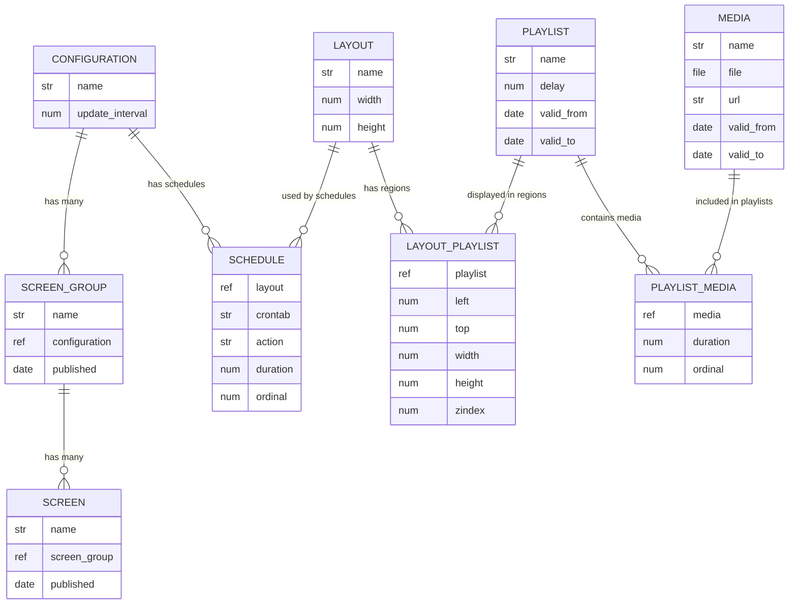
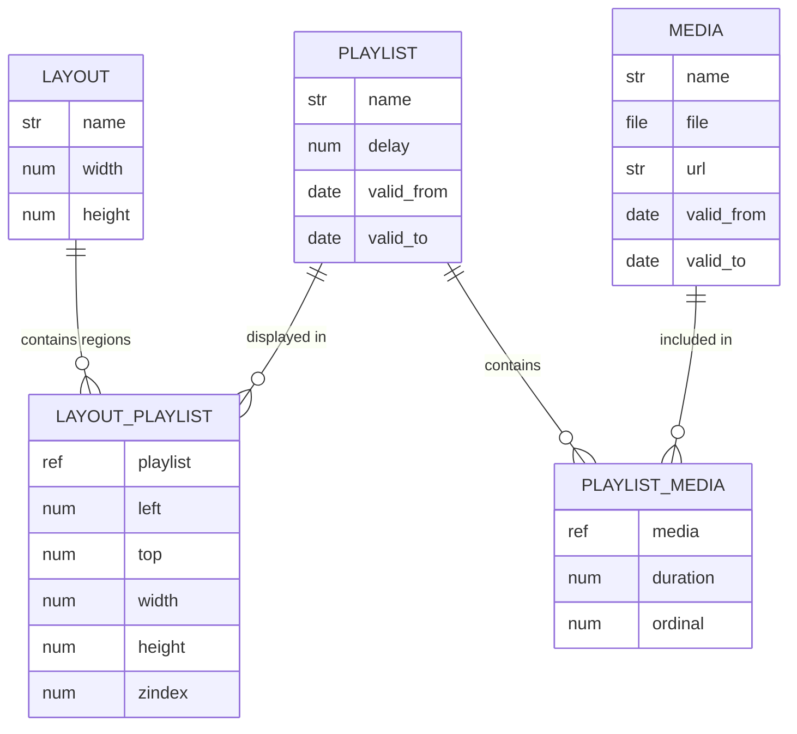
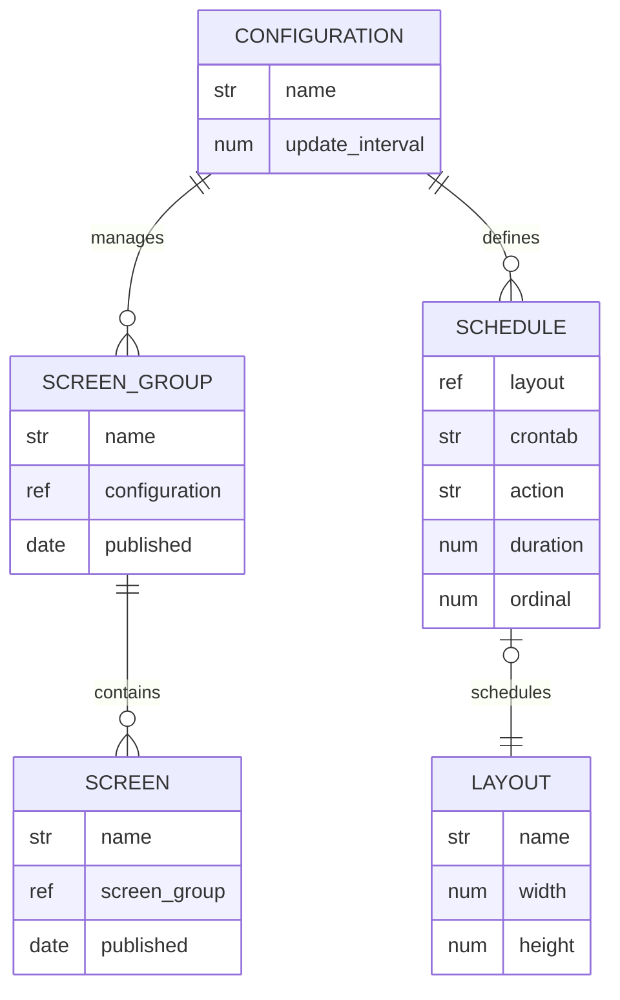

# Data Model: ScreenWerk Entity Structure

This document describes the entity structure of the ScreenWerk system, focusing on core entities that participate in the entity-relationship model. The data model uses an `add_from` property to indicate entity relationships, helping to distinguish between main tables, child entities, and many-to-many relationship tables. This documentation serves as a reference for developers working with the ScreenWerk digital signage system.

## Data Source and Generation

The entity definitions are stored in the Entu database and can be accessed via the API. To generate the complete data model with entities and their properties:

**Step 1**: Explore the API using HTTP requests:

```http
# Get all entities with add_from property
GET {{hostname}}/{{account}}/entity?_type.string=entity&limit=100&props=name.string,add_from.string

# Get properties for a specific entity definition
GET {{hostname}}/{{account}}/entity?_type.string=property&_parent.reference={{definitionId}}&props=name.string,type.string,reference_query.string
```

**Step 2**: Use the automated script to build the complete data model:

```bash
# Fetches all sw_ entities with add_from values and their properties
node scripts/fetch-sw-entities.js
```

This script generates `sw-entities.json`, which contains the full entity structure with field definitions, types, and relationship metadata.

## Entity Relationship Model

The ScreenWerk entities follow an Entity-Relationship model structure, indicated by the `add_from` property. This property shows the entity's relationship in the data model:

1. **Main Entities** (`add_from="customer"`): These represent primary tables in the database
2. **Child Entities**: These are part of a parent-child relationship (one-to-many)
3. **Relationship Entities**: These connect main entities (many-to-many relationships)

Each entity serves a specific purpose within the digital signage ecosystem, allowing for flexible configuration, content management, and display scheduling.

Below is a detailed breakdown of entities by their relationship types:

### Main Entities (Primary Tables)

#### `sw_configuration` (Parent: `customer`)

- **Description**: Manages configuration settings for screen groups
- **Key Properties**:
  - `name` (string)
  - `update_interval` (number)

#### `sw_layout` (Parent: `customer`)

- **Description**: Defines display layouts with dimensions
- **Key Properties**:
  - `name` (string)
  - `width/height` (number)

#### `sw_media` (Parent: `customer`)

- **Description**: Stores media files and metadata
- **Key Properties**:
  - `name` (string)
  - `file` (file)
  - `url` (string)
  - `type` (reference)
  - `valid_from/to` (datetime)

#### `sw_playlist` (Parent: `customer`)

- **Description**: Media collections
- **Key Properties**:
  - `name` (string)
  - `animate` (reference)
  - `delay` (number)
  - `valid_from/to` (datetime)

#### `sw_screen` (Parent: `customer`)

- **Description**: Physical display devices
- **Key Properties**:
  - `name` (string)
  - `screen_group` (reference)
  - `customer` (string)
  - `published` (datetime)

#### `sw_screen_group` (Parent: `customer`)

- **Description**: Groups of screens
- **Key Properties**:
  - `name` (string)
  - `configuration` (reference)
  - `published` (datetime)

### Child Entities (One-to-Many Relationships)

#### `sw_schedule` (Parent: `sw_configuration`)

- **Description**: Scheduled layouts for a configuration
- **Key Properties**:
  - `layout` (reference)
  - `crontab` (string)
  - `action` (string)
  - `duration` (number)
  - `ordinal` (number)

### Relationship Entities (Many-to-Many)

#### `sw_layout_playlist` (Parent: `sw_layout`)

- **Description**: Connects layouts with playlists
- **Key Properties**:
  - `playlist` (reference)
  - `left/top/width/height` (number)
  - `zindex` (number)

#### `sw_playlist_media` (Parent: `sw_playlist`)

- **Description**: Connects playlists with media items
- **Key Properties**:
  - `media` (reference)
  - `duration` (number)
  - `ordinal` (number)

## Entity Fields

Each entity has specific fields that define its properties. Reference the `sw-entities.json` file for detailed field information. Key field types include:

- `string`: Text values
- `number`: Numeric values
- `boolean`: True/false values
- `datetime`: Date and time values
- `reference`: References to other entities (foreign keys)
- `file`: File attachments

## Entity Relationships

1. **Main Entities** (with `add_from="customer"`) represent core business objects:

   - `sw_media`: Media files
   - `sw_playlist`: Media collections
   - `sw_layout`: Position playlists on screens
   - `sw_configuration`: Configuration settings
   - `sw_screen`: Physical displays
   - `sw_screen_group`: Groups of screens

2. **Child Entities** represent one-to-many relationships:
   - `sw_schedule`: Each configuration can have multiple layouts scheduled at different times.

3. **Relationship Entities** connect main entities, representing many-to-many relationships:
   - `sw_layout_playlist`: Connects layouts with playlists (a layout can have many playlists in different regions, and a playlist can be used in multiple layouts)
   - `sw_playlist_media`: Connects playlists with media items (a playlist contains many media items, and media items can be used in multiple playlists)

This ER model structure enables complex relationships between the core entities while maintaining data normalization and providing a flexible foundation for the ScreenWerk digital signage system.

## ER Diagram



### Diagram Guide

- **Main Entities**: CONFIGURATION, LAYOUT, PLAYLIST, MEDIA, SCREEN_GROUP, SCREEN
- **Child Entity**: SCHEDULE (owned by CONFIGURATION)
- **Relationship Entities**: LAYOUT_PLAYLIST, PLAYLIST_MEDIA
- **Flow**:
  - Configuration defines screen groups and schedules
  - Schedules use layouts
  - Layouts contain regions (layout_playlists)
  - Each region displays a playlist
  - Playlists contain media items
- **Relationships**:
  - `||--o{` : One-to-many (e.g., one configuration has many screen groups)
  - `}o--||` : Many-to-one (e.g., many layout regions belong to one layout)

## Alternative Perspectives

The above diagram shows the complete administrative view of the ScreenWerk system. Below are alternative perspectives focusing on different aspects of the system:

### Player/Content Delivery Perspective

From the player's perspective, the system is much simpler. The player receives a layout and needs to know what content to display where

**Player Flow**: Layout defines regions → Each region plays a playlist → Playlist contains media in sequence → Media files are displayed

*Note: The player doesn't need to know about configurations, schedules, or screen management - it simply receives a layout and renders the content.*



**Organization Flow**: Layout → Regions → Playlists → Media Items

### System Administration Perspective

From a system administrator's viewpoint, focusing on device and configuration management:



**Management Flow**: Configuration → Screen Groups → Screens & Schedules → Layouts
